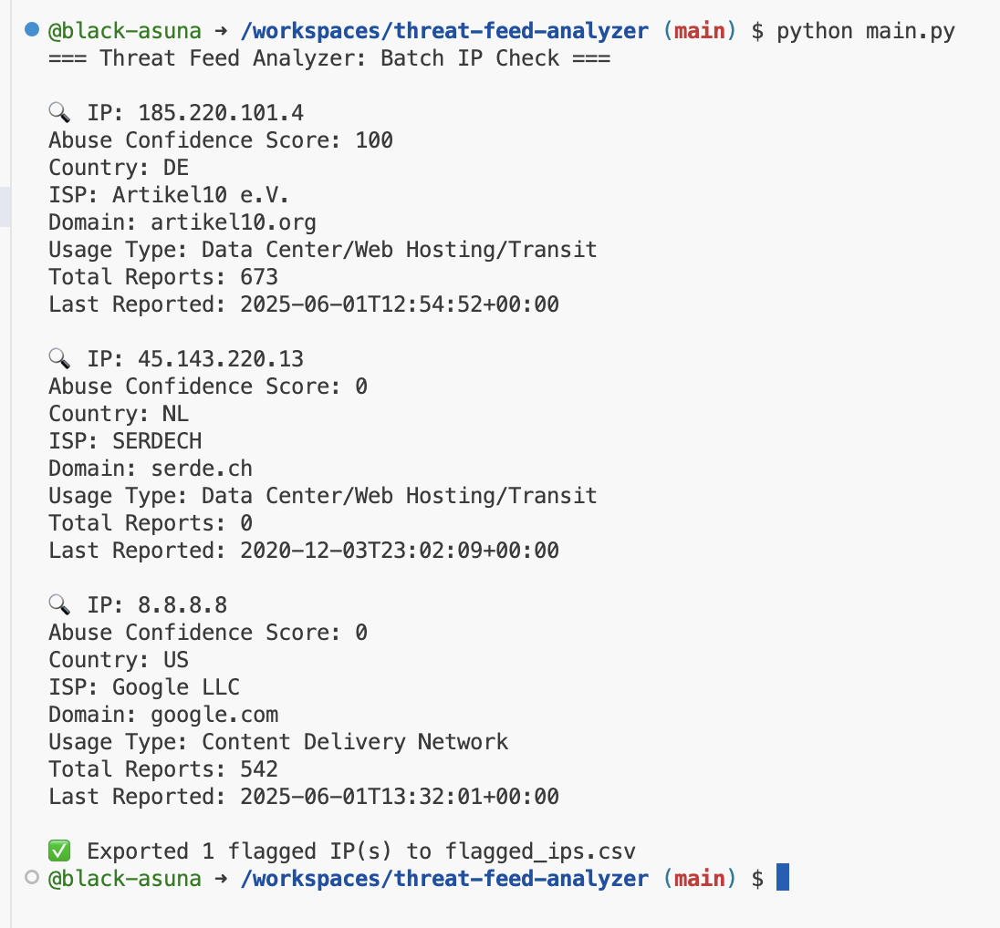

# 🛡️ Threat Feed Analyzer


A lightweight Python tool that leverages open-source threat intelligence feeds to identify and analyze suspicious IP addresses. Built as a cybersecurity portfolio project, it demonstrates API usage, batch automation, data filtering, and reporting — ideal for junior threat analysts and tech-savvy learners.

---

## Features

- Query IPs against [AbuseIPDB](https://www.abuseipdb.com/) threat intelligence database  
- Batch scan IPs from a text file  
- Export high-risk results to `flagged_ips.csv`  
- Secure API key management using `.env`  
- Filter threats based on abuse confidence score  
- Lightweight, fast, and beginner-friendly

---

## Tech Stack

- Python 3.x  
- [AbuseIPDB API](https://www.abuseipdb.com/)  
- `requests`, `python-dotenv`, `csv`

---

## Getting Started

### 1. Clone the repo
```bash
git clone https://github.com/black-asuna/threat-feed-analyzer.git
cd threat-feed-analyzer
```

### 2. Create your `.env` file
In the root folder, create a file named `.env` and add:

```bash
API_KEY = your_abuseipdb_api_key_here
```

Never commit this file. It’s ignored via `.gitignore`

### 3. Install dependencies
```bash
pip install -r requirements.txt
```
### 4. Add IPs to scan

Create a text file named `ips.txt` with one IP per line:

```bash
185.220.101.4

8.8.8.8
```
### 5. Run the script
```bash
python main.py
```

---

## Sample Output
```yaml
🔍 IP: 185.220.101.4

Abuse Confidence Score: 100

Country: DE

Domain: artikel10.org

...

✅ Exported 1 flagged IP(s) to flagged_ips.csv
```

## Output

The tool creates a CSV report with only high-risk IPs (abuse score ≥ 50)

```makefile
IP,Score,Country,Domain,Last Reported

185.220.101.4,100,DE,artikel10.org,2025-05-31T22:40:19+00:00
```

## 📸 Preview

Here’s the tool in action, checking IPs and exporting flagged results:




## Security Note

API key is stored securely in a .env file and excluded from GitHub with .gitignore. This keeps your key private even when your code is public.

## Future Improvements

- Add Shodan enrichment support
- Visualize abuse data in charts
- Add severity level tags (e.g., High, Medium, Low)
- Turn into a simple web app with Flask

## 👩‍💻 Author

Soeli Llinas
Aspiring Cybersecurity Analyst · Home Depot Associate · 
2x SWE Intern

🔗 GitHub: black-asuna

🔗 LinkedIn: https://www.linkedin.com/in/sllinasrosa/

## License

MIT License — use freely, with credit appreciated 


---


